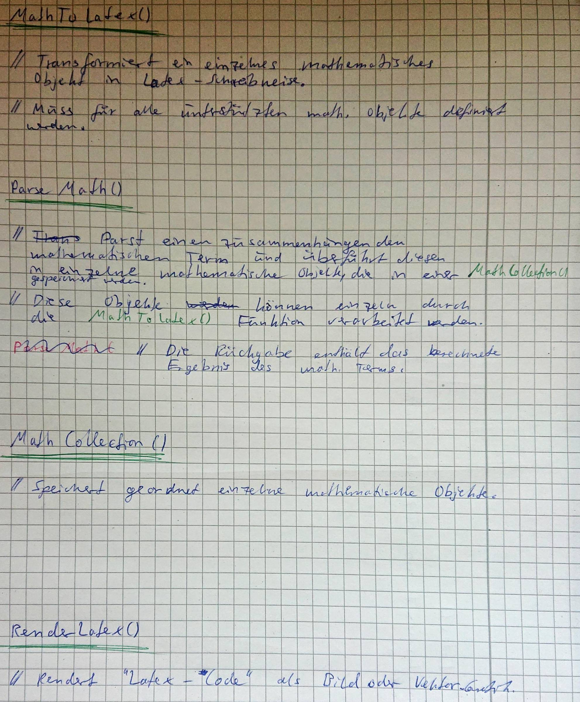
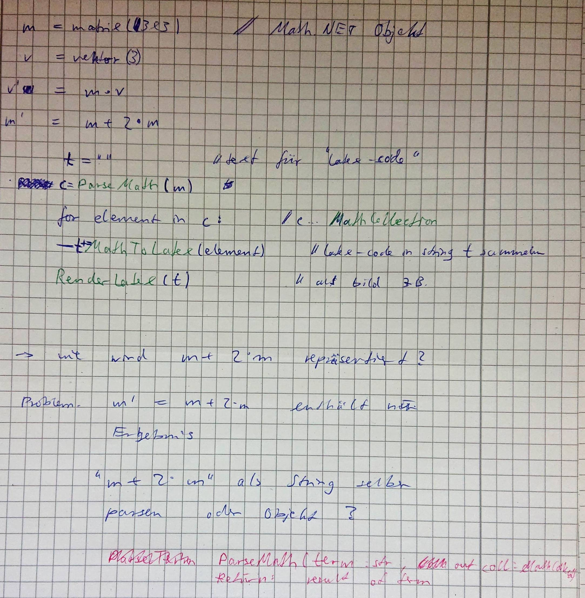

# Softwareentwicklung 2022 - Projekt

&nbsp;
&nbsp;
<!-- &nbsp; -->
<!-- &nbsp; -->

## Zielstellung

>*Transformation von Math.NET Inhalten (Matrizen, Formeln usw.) nach Latex*

Das Ergbenis soll ein wiederverwendbare Class-Library (DLL) sein, die dem Programmierer die Möglichkeit gibt, mathematische C#-Objekte der Math.NET Bibliothek in Latex zu transformieren und als Text oder Bild zu speichern.

Eventuell möchten wir diese Class-Library dann auch als NuGet-Package unter dem Name "MaTeX" zur Verfügung stellen.

**Erster Softwareentwurf:**

Funktionen mit Beschreibung

Pseudocode mit Anwendungskonzept

<!-- https://github.com/fb89zila/exam-repo_swe-sose21/wiki/Developer -->

**Dependencies:**

- [Math.NET Numerics](https://www.nuget.org/packages/MathNet.Numerics)
- [MathNet.Symbolics](https://www.nuget.org/packages/MathNet.Symbolics)
- [CSharp Math](https://www.nuget.org/packages/CSharpMath)

## Zeitplan

|             Datum | Bemerkung                                                                           |
| -----------------:| ----------------------------------------------------------------------------------- |
|     21. Juni 2022 | Rückmeldung der Gruppen zur Teilnahme an der praktischen Prüfungsleistung           |
|                   | Anlegen eines Repositories und Erläuterung Ihrer Zielstellungen im Wiki             |                   |                   |                                                                                     |
|  bis 7. Juli 2022 | Spezifikation einer Fragestellung und zugehöriger Softwareentwurf                   |
| bis 14. Juli 2022 | Bestätigung der Idee und des Entwurfes                                              |
|                   | Bearbeitung der Aufgabenstellung in einem GitHub Projekt mit eingeladenen Betreuern |
|     26. Juli 2022 | (Tag der Klausur) Abschluss der Bearbeitung, die Repos werden gespiegelt.           | 

## Kriterienkatalog

In der Bewertung fließen neben der eigentlichen Implementierung insbesondere der Entwurf und der Entwicklungsprozess ein!

| Aspekt             | Maßstäbe                                                                   | Bewertungsgewicht |
| ------------------ | -------------------------------------------------------------------------- | ----------------- |
| Funktionalität     | Komplexität, Originalität, Grundidee                                       | 20 %              |
| Softwareentwurf    | Klassendesign, Dokumentation des methodischen Vorgehens, integrierte Tests | 20 %              |
| Umsetzung          | Lauffähigkeit, Qualität der Implementierung,                               | 30 %              |
| Versionsmanagement | Entwicklungsfluss auf Github, Teamwork                                     | 20 %              |
| Dokumentation      | Tutorial, Beispielcode, Erläuterungen der API                              | 10 %              |
