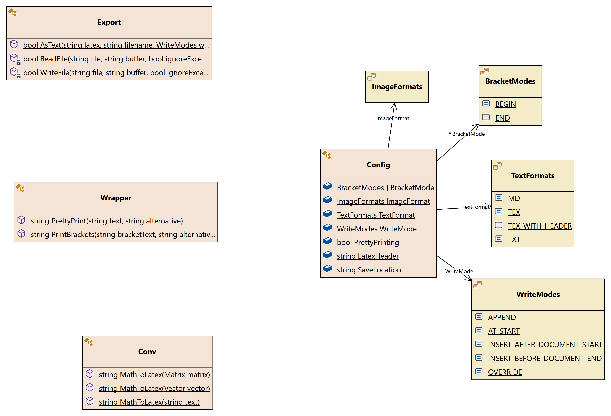

# Softwareentwicklung 2022 - Projekt <!-- omit in toc -->

&nbsp;
&nbsp;
&nbsp;
&nbsp;
&nbsp;

**Übersicht:**

- [Zielstellung](#zielstellung)
- [Aktueller Stand](#aktueller-stand)
  - [CodeMap von MaTeX.cs](#codemap-von-matexcs)
  - [Dokumentation](#dokumentation)
  - [Dependencies](#dependencies)
- [Zeitplan](#zeitplan)
- [Kriterienkatalog](#kriterienkatalog)
  - [Wichtiger Hinweis](#wichtiger-hinweis)

## Zielstellung

>*Transformation von Math.NET Inhalten (Matrizen, Vektoren, Terme usw.) nach Latex*

Das Ergbenis soll ein wiederverwendbare Klassenbibliothek sein, die dem Programmierer die Möglichkeit gibt, mathematische C#-Objekte der Math.NET Bibliothek in LaTeX zu transformieren und als Text zu speichern.

## Aktueller Stand

### CodeMap von [MaTeX.cs](/src/MaTeX/MaTeX.cs)

### Dokumentation

- Dokumentation [öffnen](https://ifi-softwareentwicklung-sose2022.github.io/SWE22_Projekt)
<!--  -->
- als GitHub-Page im Branch [gh-pages](https://github.com/Ifi-Softwareentwicklung-SoSe2022/SWE22_Projekt/tree/gh-pages)
- mit VS Code Extension [Markdown All in One](https://marketplace.visualstudio.com/items?itemName=yzhang.markdown-all-in-one) aus [Dokumentation.md](https://github.com/Ifi-Softwareentwicklung-SoSe2022/SWE22_Projekt/blob/gh-pages/docs/Dokumentation.md) generiert

### Dependencies

- GitHub Dependency Übersicht [öffnen](https://github.com/Ifi-Softwareentwicklung-SoSe2022/SWE22_Projekt/network/dependencies)
<!--  -->
- [CSharpMath](https://www.nuget.org/packages/CSharpMath)
- [Math.NET Numerics](https://www.nuget.org/packages/MathNet.Numerics)
- [Math.NET Symbolics](https://www.nuget.org/packages/MathNet.Symbolics)
- [Microsoft.CodeAnalysis.CSharp.Scripting](https://www.nuget.org/packages/Microsoft.CodeAnalysis.CSharp.Scripting)  

## Zeitplan

|             Datum | Bemerkung                                                                           |
| -----------------:| ----------------------------------------------------------------------------------- |
|     21. Juni 2022 | Rückmeldung der Gruppen zur Teilnahme an der praktischen Prüfungsleistung           |
|                   | Anlegen eines Repositories und Erläuterung Ihrer Zielstellungen im Wiki             |
|  bis 7. Juli 2022 | Spezifikation einer Fragestellung und zugehöriger Softwareentwurf                   |
| bis 14. Juli 2022 | Bestätigung der Idee und des Entwurfes                                              |
|                   | Bearbeitung der Aufgabenstellung in einem GitHub Projekt mit eingeladenen Betreuern |
|     26. Juli 2022 | (Tag der Klausur) Abschluss der Bearbeitung, die Repos werden gespiegelt.           | 

## Kriterienkatalog

In der Bewertung fließen neben der eigentlichen Implementierung insbesondere der Entwurf und der Entwicklungsprozess ein!

| Aspekt             | Maßstäbe                                                                   | Bewertungsgewicht |
| ------------------ | -------------------------------------------------------------------------- | ----------------- |
| Funktionalität     | Komplexität, Originalität, Grundidee                                       | 20 %              |
| Softwareentwurf    | Klassendesign, Dokumentation des methodischen Vorgehens, integrierte Tests | 20 %              |
| Umsetzung          | Lauffähigkeit, Qualität der Implementierung,                               | 30 %              |
| Versionsmanagement | Entwicklungsfluss auf Github, Teamwork                                     | 20 %              |
| Dokumentation      | Tutorial, Beispielcode, Erläuterungen der API                              | 10 %              |

### Wichtiger Hinweis

- in der [Contributors Übersicht](https://github.com/Ifi-Softwareentwicklung-SoSe2022/SWE22_Projekt/graphs/contributors?type=c) ist aus uns unbekannten Gründen zu sehen, dass [@Tom11311](https://github.com/Tom11311) nur sehr wenige *Commits* gemacht hätte, obwohl es eigentlich ca. 14 sind

- auch die angezeigten *Additions* / *Deletions* sind fehrlerhaft, da er u.a. das *Testing* übernommen hat, wie an folgenden *Pull-Requests* und *Issues* zu sehen ist:
  [#1](https://github.com/Ifi-Softwareentwicklung-SoSe2022/SWE22_Projekt/issues/1),
  [#10](https://github.com/Ifi-Softwareentwicklung-SoSe2022/SWE22_Projekt/issues/10),
  [#19](https://github.com/Ifi-Softwareentwicklung-SoSe2022/SWE22_Projekt/issues/19),
  [#2](https://github.com/Ifi-Softwareentwicklung-SoSe2022/SWE22_Projekt/pull/2),
  [#17](https://github.com/Ifi-Softwareentwicklung-SoSe2022/SWE22_Projekt/pull/17),
  [#11](https://github.com/Ifi-Softwareentwicklung-SoSe2022/SWE22_Projekt/pull/11)

- Kurz gesagt: Es soll nicht fälschlicherweise der Eindruck entehen, dass er nichts beigetragen hätte.
